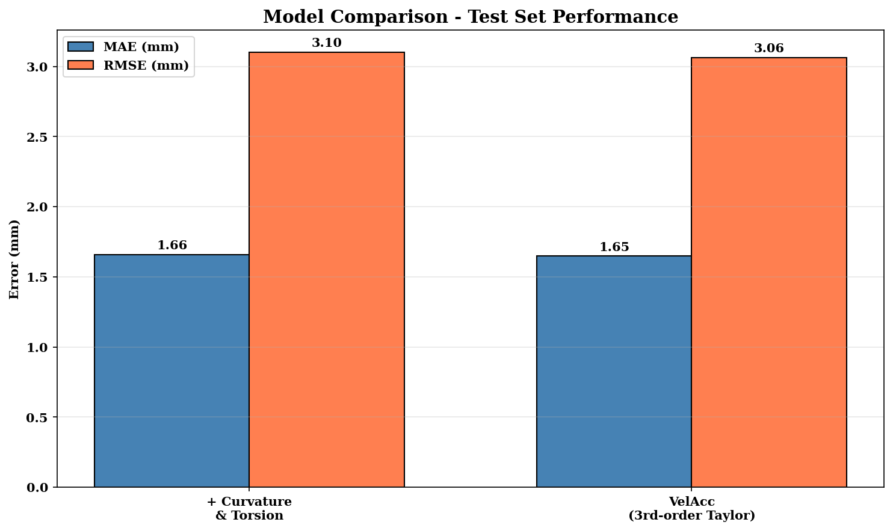
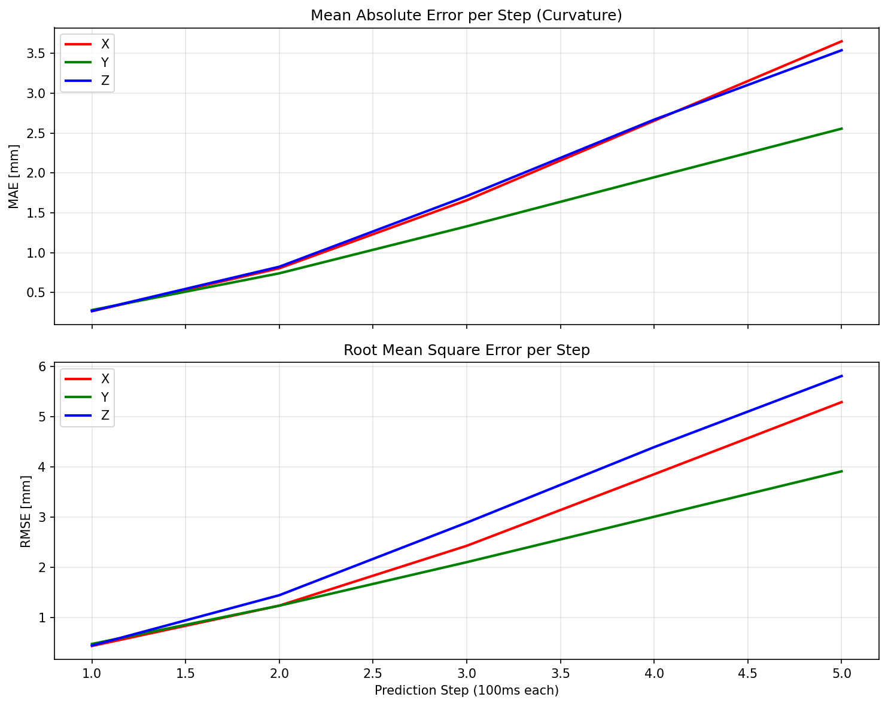
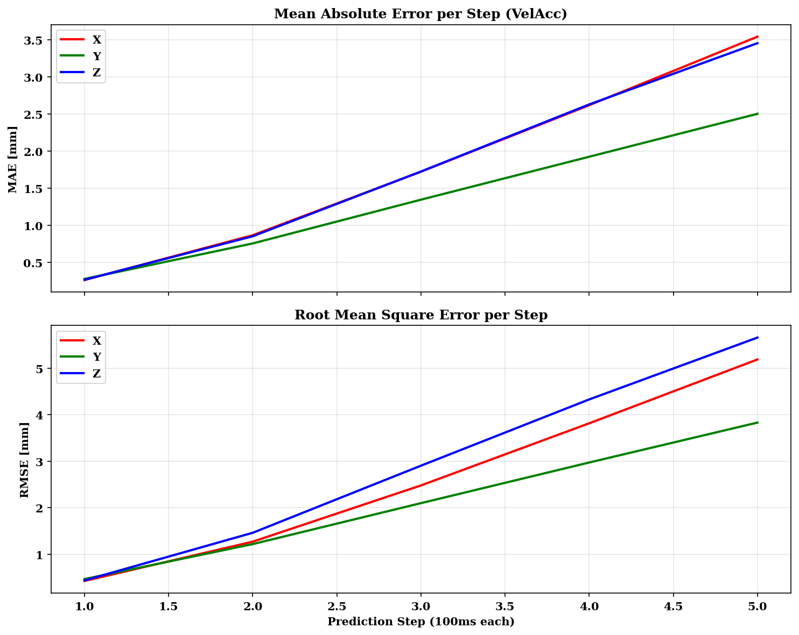
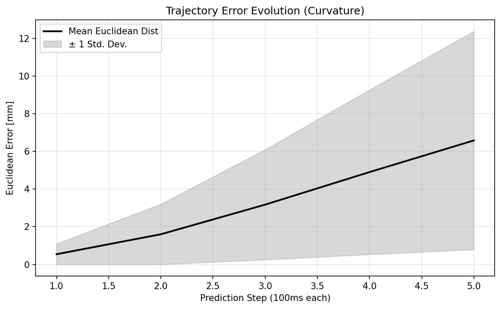
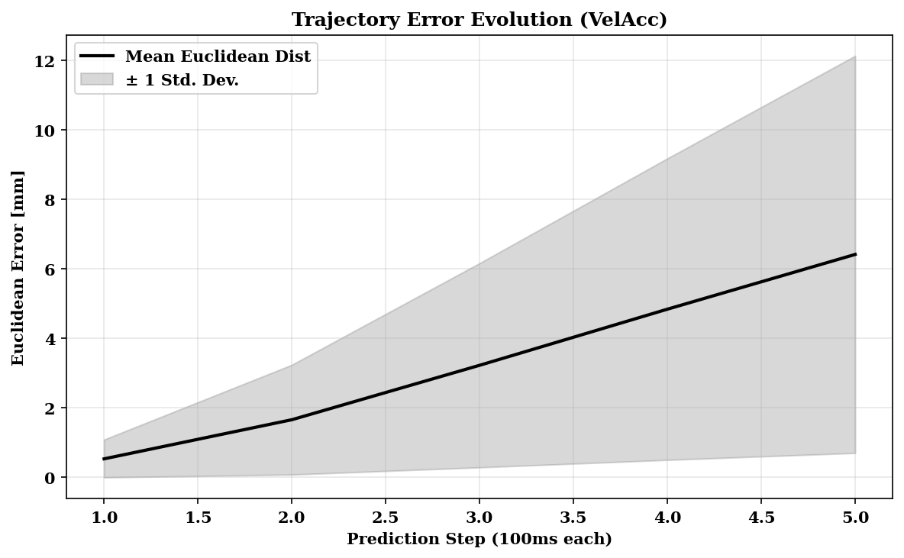
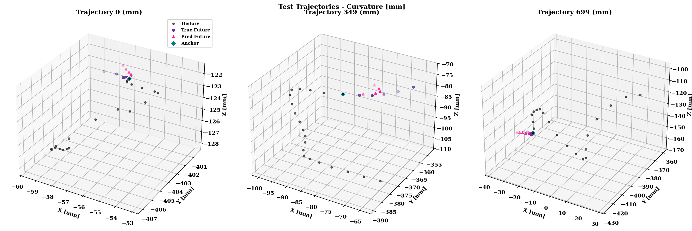
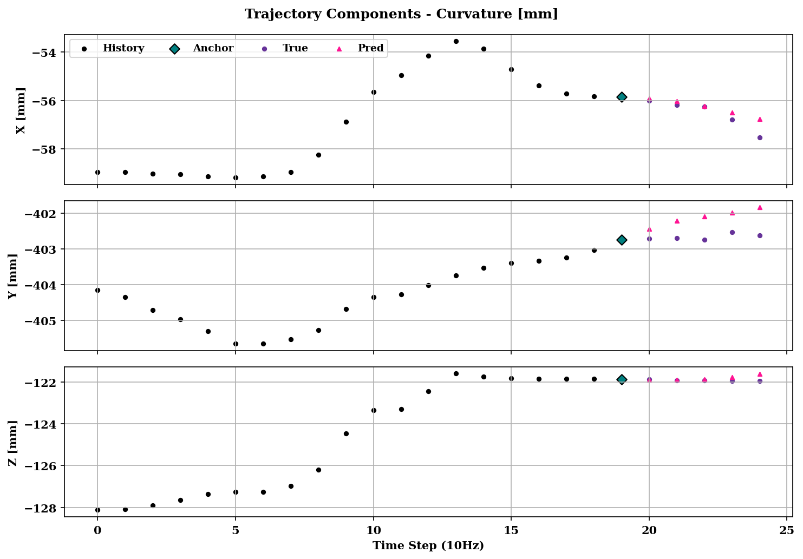

# Trajectory Prediction using Physics-Informed Seq2Seq LSTM

A deep learning approach for trajectory prediction using a sequence-to-sequence LSTM architecture with physics-based motion integration and temporal downsampling.

## Overview

This project implements a trajectory prediction model that combines:
- **LSTM Encoder-Decoder Architecture**: Captures long-term temporal dependencies with cell state memory
- **Physics-Based Integration**: Uses Velocity Verlet integration for physically plausible predictions
- **Temporal Downsampling**: Reduces input from 100Hz to 10Hz for efficient learning
- **Teacher Forcing**: Improves training stability with scheduled sampling

The model predicts future 3D positions, velocities, and accelerations given a history of observed trajectory points.

## Project Structure

```
├── config.py                 # Hyperparameters and settings
├── train.py                  # Main training script (baseline DaVinciNet)
├── train_curvature.py        # Training with curvature/torsion features
├── train_vel_acc.py          # Training with VelAcc decoder (3rd-order Taylor)
├── generate_plots.py         # Evaluation & plot generation script
├── data/
│   ├── dataset.py            # PyTorch Dataset class
│   ├── preprocessing.py      # Data normalization functions
│   └── features.py           # Curvature & torsion feature engineering
├── models/
│   └── seq2seq.py            # Encoder, Decoder, and Seq2Seq models
├── utils/
│   ├── losses.py             # ADE loss function
│   ├── evaluation.py         # Evaluation metrics (MAE, RMSE, L2)
│   └── visualization.py      # 3D trajectory plotting
├── images/                   # Generated evaluation plots
└── requirements.txt          # Python dependencies
```

### Available Models

1. **Seq2SeqLSTM**: Standard LSTM encoder-decoder with Velocity Verlet physics
2. **Seq2SeqDaVinciNet**: Advanced architecture with input attention (encoder) and temporal attention (decoder), inspired by "daVinciNet: Joint Prediction of Motion and Surgical State" (Qin et al., 2020)

## Model Architecture

```
Raw Input (100Hz)
        │
        ▼
┌─────────────────────┐
│  Downsample (10Hz)  │
└─────────────────────┘
        │
        ▼
Input Sequence (20 steps @ 10Hz)
        │
        ▼
┌────────────────┐
│  LSTM Encoder  │  ──►  Hidden State + Cell State
└────────────────┘
        │
        ▼
┌────────────────┐
│  LSTM Decoder  │  +  Velocity Verlet Physics
└────────────────┘
        │
        ▼
Predicted Trajectory (5 steps @ 10Hz)
   [position, velocity, acceleration]
```

### Key Components

| Component | Description |
|-----------|-------------|
| `Encoder_LSTM` | Encodes input trajectory into hidden representation with cell state |
| `Decoder_LSTM` | Autoregressively generates future predictions |
| `Seq2SeqLSTM` | Combines encoder/decoder with physics integration |

### Downsampling

The model uses temporal downsampling to reduce computational complexity and focus on longer-term motion patterns:
- **Original frequency**: 100Hz
- **Downsampled frequency**: 10Hz (factor of 10)
- **Input window**: 200 steps → 20 steps
- **Prediction horizon**: 50 steps → 5 steps
- **Time step (Δt)**: 0.01s → 0.1s

## Installation

1. Clone the repository:
```bash
git clone https://github.com/Idogur10/Projects.git
cd Projects
```

2. Create virtual environment:
```bash
python -m venv venv
venv\Scripts\activate  # Windows
# source venv/bin/activate  # Linux/Mac
```

3. Install dependencies:
```bash
pip install -r requirements.txt
```

4. For GPU support (recommended):
```bash
pip install torch --index-url https://download.pytorch.org/whl/cu124
```

## Configuration

Edit `config.py` to modify hyperparameters:

| Parameter | Default | Description |
|-----------|---------|-------------|
| `HIDDEN_DIM` | 96 | LSTM hidden layer size |
| `NUM_LAYERS` | 1 | Number of stacked LSTM layers |
| `BATCH_SIZE` | 512 | Training batch size |
| `N_EPOCHS` | 500 | Maximum training epochs |
| `LEARNING_RATE` | 1e-4 | Adam optimizer learning rate |
| `DOWNSAMPLE_FACTOR` | 10 | Downsampling ratio (100Hz → 10Hz) |
| `WINDOW_SIZE` | 20 | Input sequence length (after downsampling) |
| `HORIZON` | 5 | Prediction horizon (after downsampling) |
| `DELTA_T` | 0.1 | Time step in seconds (after downsampling) |

## Usage

### Training

```bash
python train.py
```

The training script will:
1. Load and preprocess trajectory data
2. Train the model with early stopping
3. Evaluate on validation/test sets
4. Generate visualization plots
5. Save the best model to `best_model.pth`

### Data Format

Input data should be `.npy` files with shape `(N, sequence_length, 13)`:
- Columns 0-2: Position (X, Y, Z)
- Columns 3-5: Velocity (Vx, Vy, Vz)
- Columns 6-8: Acceleration (Ax, Ay, Az)
- Columns 9-12: Additional features

## Evaluation Metrics

The model is evaluated using:
- **ADE (Average Displacement Error)**: Mean L2 distance between predicted and true positions
- **MAE**: Mean Absolute Error per axis (X, Y, Z)
- **RMSE**: Root Mean Square Error per axis
- **L2 Distance**: Euclidean distance at specific timesteps (10, 20, 30, 40, 50)

Results are reported in millimeters (mm).

## Loss Function

Combined weighted loss:
```
Loss = W_POS × ADE + W_VEL × MSE_velocity + W_ACC × MSE_acceleration
```

Default weights: `W_POS=1000`, `W_VEL=500`, `W_ACC=20`

## Results

Two model variants were evaluated on an unseen test set (subject U) after training with leave-one-subject-out cross-validation. Both models use the DaVinciNet encoder with input attention and temporal attention in the decoder.

### Model Comparison



| Model | MAE (mm) | RMSE (mm) |
|-------|----------|-----------|
| **DaVinciNet + Curvature/Torsion** (Verlet integration) | 1.66 | 3.10 |
| **DaVinciNet VelAcc** (3rd-order Taylor expansion) | 1.65 | 3.06 |

Both models achieve sub-2mm average MAE across the full 500ms prediction horizon. The VelAcc variant with 3rd-order Taylor expansion shows a slight improvement (~1.3% lower RMSE), suggesting that explicitly predicting velocity and acceleration and using higher-order physics integration provides marginally better trajectory estimates.

### Per-Step Error Analysis

The error grows approximately linearly with the prediction horizon, which is expected for autoregressive trajectory prediction.

#### DaVinciNet + Curvature/Torsion



| Step | Time (ms) | L2 Distance (mm) | MAE-X (mm) | MAE-Y (mm) | MAE-Z (mm) |
|------|-----------|-------------------|------------|------------|------------|
| 1 | 100 | 0.54 | 0.27 | 0.28 | 0.27 |
| 2 | 200 | 1.60 | 0.80 | 0.74 | 0.82 |
| 3 | 300 | 3.17 | 1.66 | 1.33 | 1.71 |
| 4 | 400 | 4.90 | 2.65 | 1.95 | 2.67 |
| 5 | 500 | 6.58 | 3.65 | 2.56 | 3.54 |

#### DaVinciNet VelAcc (3rd-order Taylor)



| Step | Time (ms) | L2 Distance (mm) | MAE-X (mm) | MAE-Y (mm) | MAE-Z (mm) |
|------|-----------|-------------------|------------|------------|------------|
| 1 | 100 | 0.53 | 0.26 | 0.28 | 0.27 |
| 2 | 200 | 1.66 | 0.87 | 0.75 | 0.85 |
| 3 | 300 | 3.22 | 1.72 | 1.34 | 1.72 |
| 4 | 400 | 4.84 | 2.62 | 1.92 | 2.63 |
| 5 | 500 | 6.41 | 3.54 | 2.50 | 3.45 |

**Key observations:**
- At **100ms** (step 1), both models achieve ~0.5mm L2 error, well within surgical precision requirements
- At **500ms** (step 5), the L2 error reaches ~6.5mm, which is still reasonable for a 0.5-second lookahead in robot-assisted surgery
- The **Y-axis** consistently has the lowest error across all timesteps, likely because vertical motion (gravity-aligned) is more predictable
- The **X and Z axes** (horizontal plane) show higher errors, reflecting more complex lateral surgical instrument movements
- Error grows approximately **linearly** with time, indicating stable autoregressive prediction without exponential drift

### Trajectory Error Evolution




The shaded region shows the standard deviation of the Euclidean error. The increasing variance at longer horizons indicates that some trajectories (likely those with sharp turns or rapid direction changes) are harder to predict, while straight-line or smooth trajectories maintain low error.

### 3D Trajectory Visualizations





The visualizations show the model's predictions (pink triangles) closely tracking the ground truth (purple circles) across different test trajectories. The black dots represent the observed history (2 seconds at 10Hz), and the teal diamond marks the anchor point where prediction begins.

### Analysis Summary

1. **Physics-informed integration matters**: Both Velocity Verlet and 3rd-order Taylor integration enforce physically plausible trajectories, preventing unrealistic jumps or discontinuities in the predicted positions.

2. **Curvature and torsion features help**: Adding differential geometry features (log-curvature and log-torsion) provides the encoder with richer information about the local shape of the trajectory, enabling better short-term predictions.

3. **Attention mechanisms are key**: The input attention in the encoder selectively weighs which kinematic features are most relevant at each timestep, while the temporal attention in the decoder allows it to attend to different parts of the observation history when making each prediction step.

4. **Sub-millimeter accuracy at 100ms**: The ~0.5mm error at the first prediction step demonstrates the model's ability to make highly accurate short-term predictions suitable for real-time surgical assistance applications.

## Requirements

- Python 3.8+
- PyTorch 2.0+
- NumPy
- Pandas
- Matplotlib
- scikit-learn

## Author

Ido Gur

## License

This project is part of a Master's thesis.
